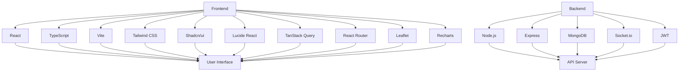

<div align="center">

# 🏥 Sehat Saathi (स्वास्थ्य साथी) 
### **Your Multilingual Healthcare Companion**

**✨Empowering communities through accessible healthcare information, mental wellness resources, and real-time support.✨**

[](https://sehat-saathi-guide.netlify.app/)
[](https://www.typescriptlang.org/)
[](https://reactjs.org/)
[](https://vitejs.dev/)
[](https://tailwindcss.com/)

---

## 📊 Project Statistics

### GitHub Stats


---

[📖 Overview](#-overview) • [✨ Features](#-key-features) • [🏗️ Architecture](#-system-design) • [🚀 Get Started](#-installation) • [🤝 Support](#-contributing)

</div>

---

## 🌐 THE MISSION
Inspired by the **SAATHI initiative at IIT Madras**, Sehat Saathi bridges the critical gap in healthcare accessibility. By combining technology with a human-centric approach, we provide a localized, multi-language guide for physical and mental well-being.


---

## 🏗️ SYSTEM DESIGN

The platform is architected for speed, modularity, and offline-first reliability.

```text
Sehat Saathi (Health Core)
┃
┣━━ 🧩 UI/UX Layer (React + Tailwind)
┃   ┣━━ 🌍 Multilingual Module .... [HINDI / ENGLISH Support]
┃   ┣━━ 🧠 Mental Wellness Hub .... [Resource Discovery]
┃   ┗━━ 📱 Responsive Interface ... [Mobile/Desktop Sync]
┃
┣━━ 🛠️ Logic Engine
┃   ┣━━ 🔍 Resource Search ........ [Optimized Filtering]
┃   ┣━━ 🏥 Healthcare Directory ... [Facility Mapping]
┃   ┗━━ 💬 Support Connect ........ [Direct Link Systems]
┃
┣━━ ⚡ Infrastructure (Vite)
┃   ┣━━ 📦 Optimized Bundling ..... [Sub-second Loads]
┃   ┗━━ 🛡️ Type-Safety (TS) ....... [Strict Data Integrity]
┃
┗━━ 📊 Analytics & Impact
    ┗━━ 📝 Feedback Loop .......... [User Growth Tracking]
---

 🌟 WHY SEHAT SAATHI?

In many communities, healthcare information and mental wellness resources are often difficult to access or shrouded in stigma. **Sehat Saathi** (meaning "Health Companion") aims to:
- **Democratize Wellness**: Make health resources accessible to everyone, regardless of their technical background.
- **Multi-language Support**: Provide guidance in regional languages including Hindi, Bengali, Marathi, Bhojpuri, and Maithili.
- **Reduce Stigma**: Offer a safe, digital space to explore wellness options and track symptoms.
- **Empower through Information**: Connect users with government schemes (Sarkari Yojana) and nearby medical facilities.

---


 ✨ KEY FEATURES

- 🩺 **Symptom Tracker**: Record and monitor health symptoms with a simple, intuitive interface. Uses a rule-based triage system to provide immediate feedback.
- 🤖 **AI Health Assistant**: Get instant guidance and answers to common health queries through a localized chat interface.
- 💊 **Medicine Store**: Browse and purchase affordable medicines with a seamless cart and checkout experience.
- 🏛️ **Sarkari Yojana**: Stay updated on government health schemes, eligibility criteria, and application processes.
- 🏥 **Nearby Hospitals**: Locate Primary Health Centres (PHC), Community Health Centres (CHC), and District Hospitals using geolocation.
- 🌍 **Multi-language Support**: Fully localized experience for diverse linguistic needs across India.
- 📱 **Progressive Web App (PWA)**: Install on mobile/desktop, works offline, and auto-updates for seamless access even in low-connectivity areas.

---

 🌐 LOCALIZATION

Sehat Saathi is built to be inclusive. We currently support the following languages:

| Language | Code | Status |
|----------|------|--------|
| Hindi (हिन्दी) | `hi` | ✅ Fully Supported |
| English | `en` | ✅ Fully Supported |
| Bengali (বাংলা) | `bn` | ✅ Fully Supported |
| Marathi (मराठी) | `mr` | ✅ Fully Supported |
| Bhojpuri (भोजपुरी) | `bho` | ✅ Fully Supported |
| Maithili (मैथिली) | `mai` | ✅ Fully Supported |

---

 ⚙️ TECHNICAL HIGHLIGHTS

- **Rule-Based Triage**: The symptom tracker uses a sophisticated evaluator (`src/lib/triage/evaluator.ts`) that matches user symptoms against predefined medical rules to suggest urgency levels.
- **Accessible UI**: Built using [Radix UI](https://www.radix-ui.com/) primitives via [shadcn/ui](https://ui.shadcn.com/), ensuring high accessibility (WAI-ARIA) standards.
- **Type Safety**: 100% TypeScript coverage for robust state management and API interactions.
- **PWA with Offline Support**: Service worker caching via Workbox enables offline access and faster load times.
- **Performance**: Optimized asset delivery and fast refresh using Vite and Bun, ensuring the app remains lightweight for mobile users.

---

 🛠️ TECH STACK

| Technology | Usage | Badge |
|------------|-------|-------|
| Frontend Framework | Core | React |
| Programming Language | Core | TypeScript |
| Build Tool | Core | Vite |
| Styling Framework | Core | Tailwind CSS |
| UI Components | UI | Shadcn/ui |
| Icons | UI | Lucide React |
| State Management | Data | TanStack Query |
| Routing | Navigation | React Router |
| Maps | Features | Leaflet |
| Data Visualization | Features | Recharts |
| Backend Runtime | Server | Node.js |
| Backend Framework | Server | Express |
| Database | Data | MongoDB |
| Real-time Communication | Communication | Socket.io |
| Authentication | Security | JWT |

### Tech Stack Graph



---

 🚀 GETTING STARTED

⭐ Prerequisites: 
- **Node.js** (v18.x or higher)
- **Bun** (Optional, but recommended for speed)

⭐ Installation:

1. **Clone the Repository**
   ```bash
   git clone https://github.com/Naman-iitm/sehat-saathi-guide.git
   cd sehat-saathi-guide
   ```

2. **Install Dependencies**
   ```bash
   bun install
   # or
   npm install
   ```

3. **Start Development Server**
   ```bash
   bun run dev
   # or
   npm run dev
   ```

The app will be live at `http://localhost:5173/`.

---

## 📖 HOW TO USE

1. **Select Language**: On your first visit, choose your preferred language from the onboarding screen.
2. **Track Symptoms**: Go to the "Symptom Tracker" to log any health issues. The system will categorize them and provide initial guidance.
3. **Consult AI**: Use the "AI Assistant" for quick questions about common ailments or wellness tips.
4. **Find Care**: Use the "Nearby Hospitals" feature to find the closest government health facility based on your current location.
5. **Explore Schemes**: Check the "Sarkari Yojana" section to see if you are eligible for any free healthcare services.

---

## 📁 PROJECT STRUCTURE

```
sehat-saathi-guide/
├── public/                 # Static assets
├── screenshots/            # UI screenshots for documentation
├── src/                    # Source code
│   ├── components/         # React components (AIAssistant, Cart, etc.)
│   │   └── ui/            # shadcn/ui base components
│   ├── contexts/           # Auth, Language, and Cart contexts
│   ├── data/               # Static data for tips, medicines, and schemes
│   ├── hooks/              # Custom React hooks
│   ├── lib/                # Utility functions and triage logic
│   ├── pages/              # Main page views (Index, NotFound)
│   ├── types/              # TypeScript interfaces
│   ├── App.tsx             # Main application component & routing
│   └── index.css           # Global styles & Tailwind imports
├── components.json         # shadcn/ui configuration
├── package.json            # Project dependencies and scripts
├── tailwind.config.ts      # Tailwind CSS configuration
└── vite.config.ts          # Vite configuration
```

## 🤝 CONTRIBUTING

Contributions are what make the open-source community such an amazing place to learn, inspire, and create. Any contributions you make are **greatly appreciated**.

### How to Contribute

1. **Fork the Repository**: Click the 'Fork' button at the top right of this page to create a copy of the repository in your account.
2. **Clone your Fork**: 
   ```bash
   git clone https://github.com/YOUR_USERNAME/sehat-saathi-guide.git
   ```
3. **Create a Feature Branch**: Always create a new branch for your changes (e.g., `feature/AmazingFeature`).

   ```bash
   git checkout -b feature/AmazingFeature
   ```
4. **Commit your Changes**: Write clear and concise commit messages (e.g., `Add some AmazingFeature`).
   ```bash
   git commit -m 'Add some AmazingFeature'
   ```
5. **Push to your Fork**:
   ```bash
   git push origin feature/AmazingFeature
   ```
6. **Open a Pull Request**: Go to the original repository and click 'New Pull Request'.


---

## 📄 LICENSE

Distributed under the MIT License. See `LICENSE` for more information (coming soon).

---

## 👤 CONTACT

**Naman Jha** - [GitHub Profile](https://github.com/Naman-iitm)

**Project Link:** [https://github.com/Naman-iitm/sehat-saathi-guide](https://github.com/Naman-iitm/sehat-saathi-guide)

---

<p align="center">Made with ❤️ for a healthier community</p>
